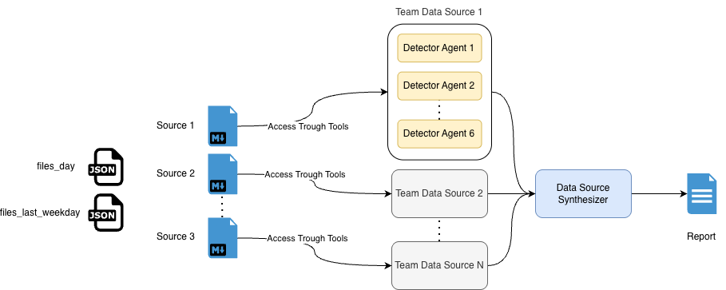
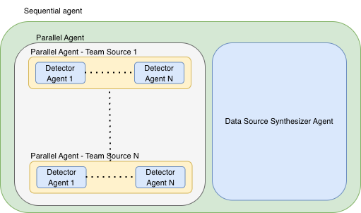

# AgentCo 





A data quality analysis agent that automatically detects issues in data ingestion pipelines and generates executive reports.

## Overview

AgentCo is an AI-powered data quality monitoring tool that analyzes data sources, detects anomalies, and produces actionable executive reports. It uses multiple detection agents to identify common data quality issues like missing files, duplicates, empty files, and volume variations.

## Features

- **Multi-Source Analysis**: Automatically discovers and analyzes multiple data sources
- **Comprehensive Detection**: Six types of data quality detectors per source:
  - Missing file detection
  - Duplicate and failed file detection  
  - Empty file detection
  - Volume variation detection
  - Late upload detection
  - Previous period file detection
- **Executive Reports**: Generates clear, actionable reports with priority levels
- **CLI Interface**: Easy-to-use command line tool
- **Parallel Processing**: Efficient analysis of multiple sources simultaneously

## Installation

```bash
uv pip install -e .
```

## Quick Start

```bash
# Analyze data quality for your sources
agentco analyze /path/to/cv_files /path/to/json_files

# Limit analysis to 3 sources and save output
agentco analyze ./cv_files ./json_files --max-sources 3 --save-output

# Get help
agentco --help
```

## Usage

### Basic Analysis

```bash
agentco analyze <cv_folder> <json_folder>
```

### Options

- `--extract-names/--no-extract-names`: Extract source names from CV file headers (default: true)
- `--max-sources <n>`: Limit analysis to n sources (useful for testing)
- `--save-output/--no-save-output`: Save report to file (default: false)  
- `--session-id <id>`: Custom session ID (default: auto-generated)

### Example Output

The tool generates executive reports with three priority levels:

- **🚨 Urgent Action Required**: Critical issues blocking processing
- **⚠️ Needs Attention**: Issues requiring monitoring or review
- **✅ No Action Needed**: Sources operating normally

## Requirements

- Python ≥ 3.12
- Google AI Development Kit (ADK)
- Environment variables for AI model access

## Project Structure

```
src/agentco/
├── cli.py              # Command line interface
├── agents/             # Detection agents
│   ├── detectors/      # Individual detector implementations
│   └── factory.py      # Agent creation and configuration
├── data/               # Data processing utilities
└── tools.py            # Analysis tools and utilities
```

## License

This project is developed by Juan Carlos Aguirre Arango.